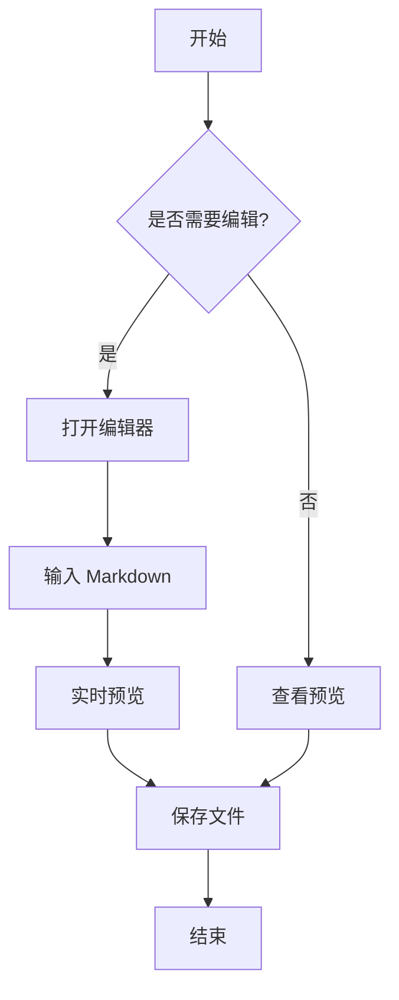
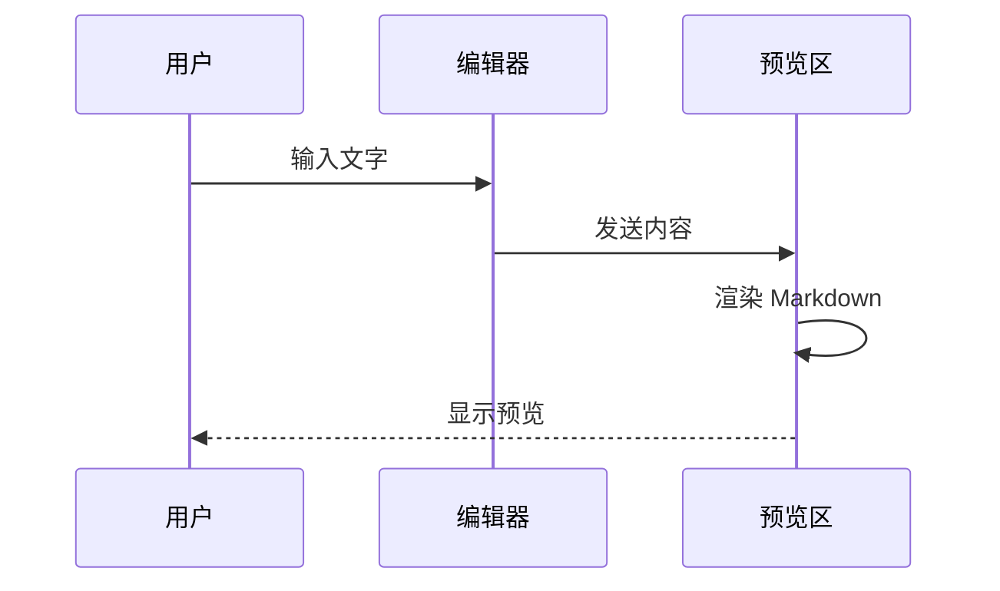

# EasyMarkdown 功能演示

欢迎使用 **EasyMarkdown** 编辑器！这是一个功能丰富的 Markdown 编辑器。

## 文本格式化

这是一段普通文本。你可以使用 **粗体**、*斜体*、~~删除线~~ 来格式化文字。

还可以使用上标 X^2^ 和下标 H~2~O。

## 列表

### 无序列表
- 第一项
- 第二项
- 第三项

### 有序列表
1. 步骤一
2. 步骤二
3. 步骤三

### 任务列表
- [x] 完成编辑器开发
- [x] 实现实时预览
- [ ] 添加更多功能
- [ ] 用户测试

## 代码

行内代码：`console.log("Hello World")`

代码块：

```javascript
function greet(name) {
  return `Hello, ${name}!`;
}

console.log(greet("EasyMarkdown"));
```

Python 代码：

```python
def fibonacci(n):
    if n <= 1:
        return n
    return fibonacci(n-1) + fibonacci(n-2)

print(fibonacci(10))
```

## 引用

> 这是一段引用文字。
> 
> Markdown 是一种轻量级标记语言，它允许人们使用易读易写的纯文本格式编写文档。

## 表格

| 功能 | 状态 | 说明 |
|------|------|------|
| 编辑器 | ✅ 完成 | CodeMirror 5 |
| 实时预览 | ✅ 完成 | GFM 支持 |
| 代码高亮 | ✅ 完成 | 50+ 语言 |
| 数学公式 | ✅ 完成 | KaTeX 渲染 |
| 图表 | ✅ 完成 | Mermaid |

## 链接和图片

访问 [GitHub](https://github.com) 了解更多。


## 数学公式

行内公式：$E = mc^2$

块级公式：

$$
\sum_{i=1}^{n} i = \frac{n(n+1)}{2}
$$

二次公式：

$$
x = \frac{-b \pm \sqrt{b^2 - 4ac}}{2a}
$$

## Mermaid 图表

### 流程图



### 时序图



## 分隔线

---

## 脚注

这里有一个脚注引用[^1]。

[^1]: 这是脚注的内容。

## HTML 支持

<details>
<summary>点击展开详情</summary>

这里可以放置隐藏的内容。

</details>

---

**EasyMarkdown** - 让 Markdown 编辑变得简单！
