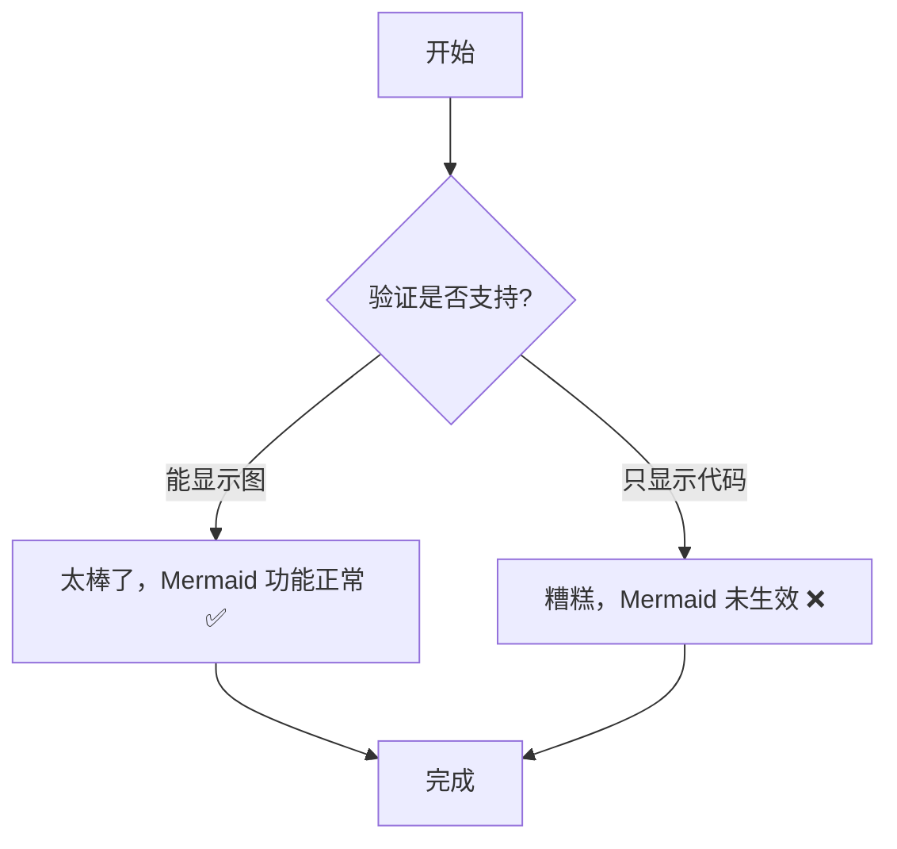

## 实例展示
> 这是一个引用块。通常用来引用别人的话，或者做重要提示。

| 功能模块 | 网页版 | 桌面版 | 说明 |
|----------|--------|--------|------|
| 实时预览 | ✅ | ✅ | 左右分栏 |
| 多标签 | ✅ | ✅ | 同时开多个文档 |
| 本地文件 | ❌ | ✅ | 直接打开文件夹 |
| 图片管理 | ❌ | ✅ | 粘贴自动保存 |
| 语音输入 | ❌ | ✅ | 需要麦克风 |
| 打印 | ✅ | ✅ | 浏览器打印 |

**实例展示**
*实例展示*
~~实例展示~~


- [x] 写完代码
- [x] 测试功能
- [ ] 写文档
- [ ] 发布版本

```javascript
function greet(name) {
  console.log("Hello, " + name);
  return true;
}
const user = "EasyMarkdown";
greet(user);
```
- 水果
  - 苹果
  - 香蕉
- 蔬菜
  - 西红柿
  - 黄瓜

1. Hello World
2. Hello Markdown

公式实例1：$$x = \frac{-b \pm \sqrt{b^2 - 4ac}}{2a}$$
公式实例2：$E = mc^2$




